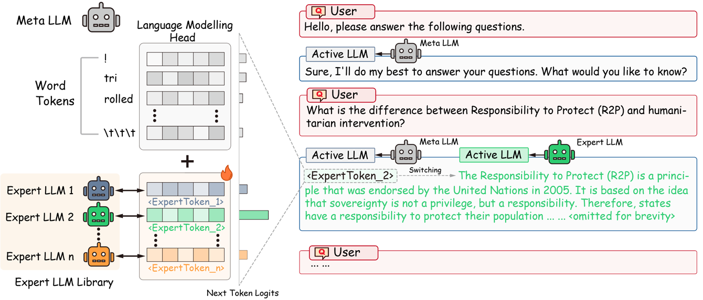

# Expert Token Routing

This repository is for "An Expert is Worth One Token: Synergizing Multiple Expert LLMs into
Generalist via Expert Token Routing".

## Overview

In this study, we focus on the following specific research question: how can we synergize various expert LLMs into a singular generalist framework?
we introduce a novel technique termed Expert Token Routing (ETR). ETR employs a hierarchical multi-expert LLM framework, wherein a meta LLM seamlessly orchestrates the allocation of tasks to expert LLMs.  The core idea of ETR is encoding expert LLMs as special tokens within the vocabulary of the meta LLM. Under this formulation, the meta LLM can route to an expert LLM like generating new tokens.




### Preparation

* Install the required packages

```shell
pip3 install -r requirements.txt
```
* Synthetic dataset from GPT-4 (all datasets uploaded) for fine-tuning expert LLMs are in  
```
.
--synthetic_mmlu
   └─clean_data
     └─[category].json
```

* Acquire the checkpoints of Qwen-7B-Chat. Please refer to [Qwen official repo](https://github.com/QwenLM/Qwen).

### Expert LLM Fine-tuning

To fine-tune a general LLM into a domain expert on the synthetic MMLU-Expert Multi-Domain Dataset, run the following command:

```shell
./finetune/finetune_expert_mmlu.sh
```

The checkpoints of expert LLMs will be dumped at `./expert_models/mmlu_expert` directory.


### ETR Inference

To run the inference of ETR, you first need to serve the expert LLMs:

```shell
./evaluation/fschat_expert_mmlu.sh
```

This script will serve the expert OpenAI-like API servers on the localhost ports using [fschat](https://github.com/lm-sys/FastChat) and [vllm](https://github.com/vllm-project/vllm). 
Then, you can run the inference of ETR:

```shell
python3 ./evaluation/eval_etr_mmlu_expert.py
```

We provide a Expert Token Head checkpoint in:
```
.
--qwen_7b_extra
   └─extra
     └─lm_head.pth
```